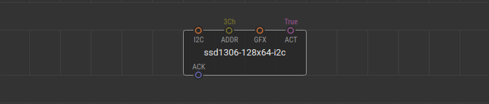
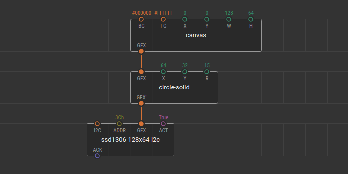
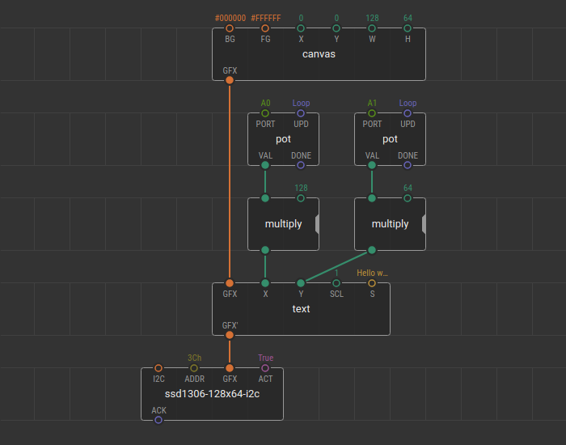

# SSD1306 displays

The SSD1306 display is an OLED that is controlled by the SSD1306 micro-chip driver, which acts as a bridge between the display matrix and the microcontroller. Due to the natural light of the organic LEDs in the matrix, SSD1306 displays are bright and have a wide viewing angle. These tiny displays are similar to those monochrome used at the old cell phones. Despite the size, these displays are very functional and capable of displaying complex images. The accessibility of this model makes it the most popular in the Arduino world and hobby electronics.

The displays breakout boards belong to the SSD1306 family can have the following parameters:

- Display resolution:
  - 0.91" (128x32 pixels);
  - 0.96" (128x64 pixels);
- Display colors (color mode):
  - Monochrome, black and white;
  - Two colors. OLEDs may have different colors, for example, one part of the display is black/white, and the other is black/yellow;
- Interfaces:
  - SPI interface (software of hardware);
  - I2C interface;

To work with the SSD1306 family displays XOD provides the [`xod-dev/ssd1306-display`](/libs/xod-dev/ssd1306-display) library.

Note
At the moment, the library allows to work only with displays with a resolution of 128x64 pixels, and connected via I2C bus.

## Quick start node

The library provides the quickstart node [`ssd1306-128x64-i2c`](/libs/xod-dev/ssd1306-display/ssd1306-128x64-i2c) for the SSD1306 I2C display with the 128x64 pixels resolution. 

This node contains everything you need to start working with the display. You only have to connect your display to the microcontroller via an I2C bus and put the I2C address value of the [byte](/docs/reference/data-types/#byte-literals) type to the `ADDR` pin field.

The `GFX` input pin of the `graphics` type specifies the graphics to render and display on the device screen. The `GFX` awaits a branch of the tree of graphical elements created using the [Graphics library](/docs/guide/graphics-library). The [boolean](/docs/reference/data-types/#boolean-literals/) value at the `ACT` pin is responsible for the display screen update due to change of the incoming graphics at the `GFX` pin.

## Quick start example

Here is a simple example of using the quick-start node. Connect the display to a microcontroller according to the wiring scheme.

Let's display a white filled circle in the center of the screen.

Create an empty patch and put the [`ssd1306-128x64-i2c`](/libs/xod-dev/ssd1306-display/ssd1306-128x64-i2c) quickstart node onto it.
The display from this example has the `3C` I2C address so we put the `3Ch` value to the `ADDR` pin.

Using the [XOD Graphics library](/docs/guide/graphics-library), create a new `canvas` with the size of a display screen. The width `W` of the `canvas` is `128` and the height `H` is `64`. The display is monochrome, and you can leave the default colors of the scene untouched. The background color `BG` is black (`#000000`) and the foreground color `FG` is white (`#FFFFFF`).

To add the filled circle to the scene, place the `circle-solid` node onto the patch. To make this node be a part of the graphic tree, link its `GFX` pin with the `GFX` pin of the `canvas`. Set the circle coordinates for the center of the screen, `64` for `X`, and `32` for `Y`. The radius `R` can be random, for example, `15`.

The scene is ready. Connect the `GFX` output pin of the `circle-solid` node to the `GFX` pin of the quickstart node. Take a look at what the patch should be.

Upload this patch and see what is displayed on the screen of the device.

You can change all parameters of the graphic nodes in a real-time.

You can change the position of the circle on the canvas using tweaks.

For example, add two [`tweak-number`](/libs/xod/debug/tweak-number) nodes for the `X` and `Y` circle coordinates. Flash the patch in debug mode and manage the coordinates of the circle center.

<video controls autoplay muted loop>
    <source src="./quickstart-example-with-tweaks.mp4" type="video/mp4">
</video>

The parameters of graphic nodes can be changed using other nodes. 

For example, let's replace the filled circle with a text field and control its position on the screen with two potentiometers.

Remove tweak nodes from the patch. Replace the `circle-solid` node with the `text` node from the `xod/graphics` library. Next, set the text string, let it be `"Hello world!"`. Enter it at the `S` pin of the `text` node.  Add two `pot` nodes and two `multiply` nodes to control the text position. The potentiometers are connected to the `A0` and `A1` Arduino ports.

By multiplying the output value of the first `pot` node by `128`, you can change the X-axis position of the text field. The value from the second `pot` is multiplied by `64` to control the Y-axis position. Upload the patch and manage the changes.

<video controls autoplay muted loop>
    <source src="./quickstart-example-with-nodes.mp4" type="video/mp4">
</video>